# B-BoT
#### Simulación de reconocimiento de objetos cotidianos para asistentes robóticos especializados en demencia senil.

1. Introducción
2. TIAGo: Simulación en Gazebo
3. Nodos ROS
   1. Nodo tomador de imágenes
   2. Nodo detector de objetos
   3. Creación del mapa con gmapping
   4. Localización y planificación de trayectorias
   5. Nodo ir a
      1. Nodo auxiliar
   6. Nodo de preparación
   7. Nodo recolector

<br>

## Introducción

**BBoT** es el proyecto que engloba las funcionalidades que se describen a continuación:
- Reconocimiento de los distintos objetos que pueda requerir el usuario en un medio doméstico.
- Trazar una trayectoria desde el punto origen donde se encuentra el robot hasta el punto destino donde se encuentra el objeto.
- Indicar y proporcionar dicho objeto al usuario haciendo uso de una mano robótica integrada en el asistente.

**BBoT** está estructurado y desarrollado haciendo uso de **ROS**,
por lo tanto, cada archivo representará a un Nodo que publicará o se subscribirá a un _Tópico_ o solicitará información a un _Servicio_ o _Acción_.

Este proyecto pretende simular un apoyo en el hogar para las personas mayores que ven reducidas sus facultades físicas debido al desarrollo de la demencia senil.

<br>

## TIAGo: Simulación en Gazebo

>Lanzar la simulación en Gazebo

```
$ catkin build
$ source devel/setup.bash
$ roslaunch tiago_gazebo tiago_gazebo.launch public_sim:=true robot:=[steel|titanium] world:=[world]
```

<br>

_Ejemplo de TIAGo en el entorno 1 de obtención de imágenes para el dataset:_

```
$ source devel/setup.bash
$ roslaunch tiago_gazebo tiago_gazebo.launch public_sim:=true robot:=steel world:=get_dataset_objects01
```


<br>

## Nodos ROS

### Nodo tomador de imágenes

Para ejecutar el nodo simplemente debemos usar el comando:

```
$ source devel/setup.bash
$ roslaunch take_images take_images_launch_file.launch
```

Una vez que se haya cargado todo, nos aparecerá **Gazebo** con la simulación del mundo que le hayamos indicado, en este caso `house.world`, una ventana con la visión de los ojos
de **TIAGo** y la ventana _pygame_ para mover la base de éste:

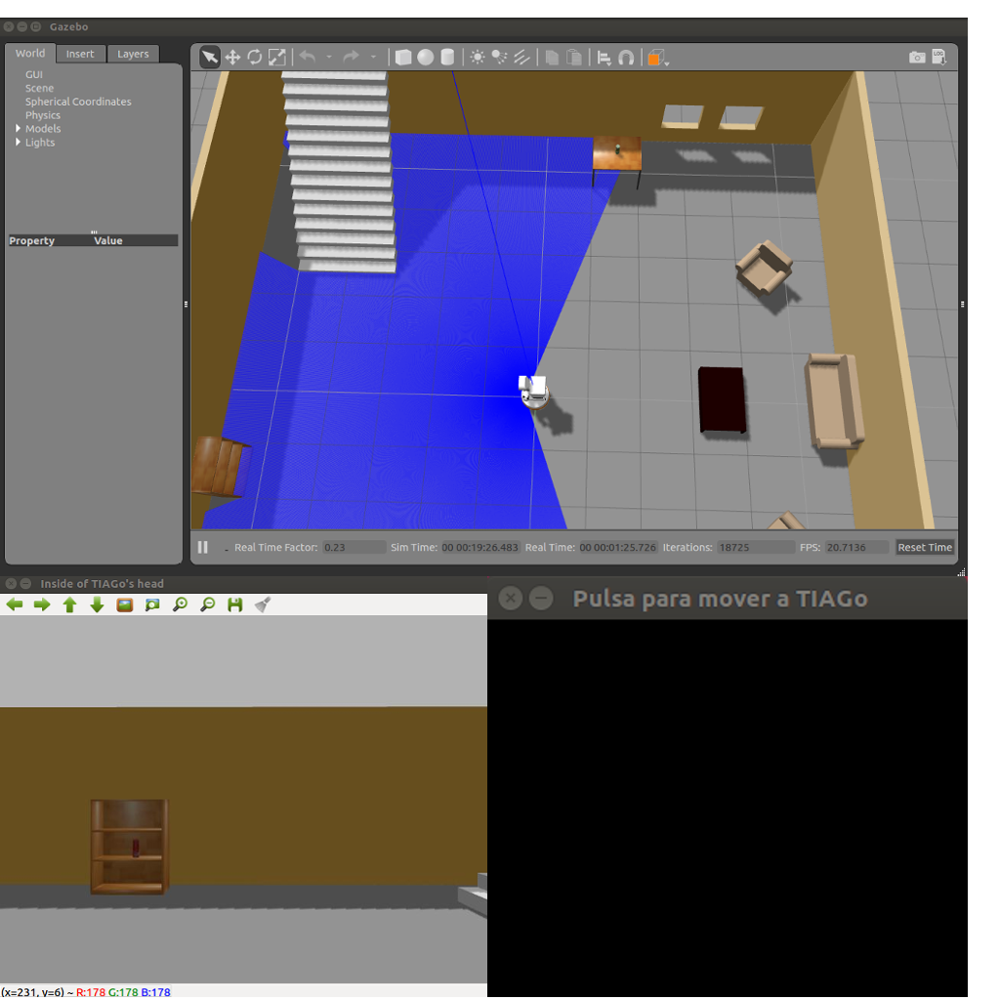


<br>

### Nodo detector de objetos

En el fichero `launch` de este nodo lanzo también el paquete _look_to_point_ y declaro el script con su correspondiente paquete.

Este nodo se puede lanzar con cualquier simulación de **TIAGo**, en mi caso lo necesito cuando ejecuto la _navegación autónoma_. Más adelante explicaré qué comandos usar y cómo configurarla.

Para lanzarlo debemos hacerlo en una nueva terminal o pestaña con el comando:

```
$ source devel/setup.bash
$ roslaunch yolo_detection_obj yolo_detection_launch_file.launch
```

En cuanto **TIAGo** empiece a detectar objetos, se mostrará mediante una ventana. En ella aparecerán el rectángulo y el nombre del objeto que hemos detectado:

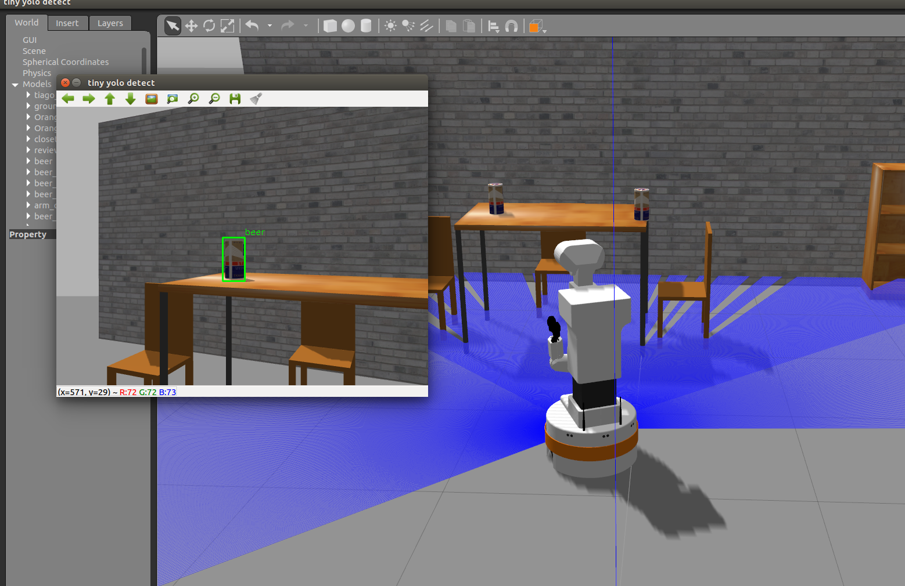


<br>

### Creación del mapa con gmapping

Para poder utilizar la navegación autónoma es necesario hacer un mapeado del entorno por el que se va a mover **TIAGo**. Con los comandos e indicaciones que se dan a continuación, crearé un mapa láser de house.world.

Abrimos una consola, nos movemos hasta la carpeta del proyecto e indicamos la ruta de las variables generadas como he indicado en los puntos anteriores. Tras esto, lanzamos el nodo para el mapeado:

*Terminal 1*
```
$ source devel/setup.bash
$ roslaunch navigation mapping_public.launch
```

Abrimos una segunda consola y lanzamos el nodo de teleoperación por teclado:

*Terminal 2*
```
$ source devel/setup.bash
$ rosrun key_teleop key_teleop.py
```

Junto con **Gazebo** se abrirá **RVIZ** que irá mostrando el proceso del mapeado:

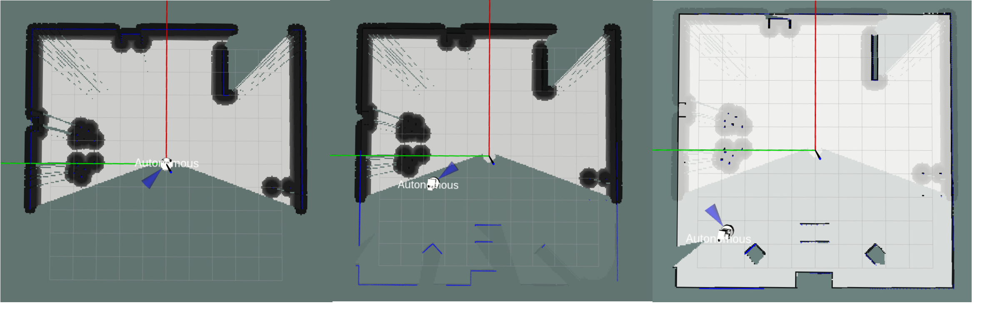

Cuando se haya finalizado el *mapeado* presionamos `q` y guardamos el mapa con el siguiente comando:

```
$ source devel/setup.bash
$ rosservice call /pal_map_manager/save_map "directory: ''"
```
El servicio guardará el mapa en la ruta `~/.pal/tiago_maps/config`.

<br>

### Localización y planificación de trayectorias

A partir del mapa construido y teniendo en cuenta la información que nos proporcionan el láser y la cámara **RGBD**, **TIAGo** podrá navegar de forma autónoma evitando obstáculos.

Abrimos una consola, nos movemos hasta la carpeta del proyecto e indicamos la ruta de las variables generadas como he indicado en los puntos anteriores. Tras esto, lanzamos el nodo para la navegación:

*Terminal 1*
```
$ source devel/setup.bash
$ roslaunch navigation navigation_public.launch
```

Se nos abrirá **Gazebo** con la simulación y **RVIZ** con el mapa construido en el paso anterior:

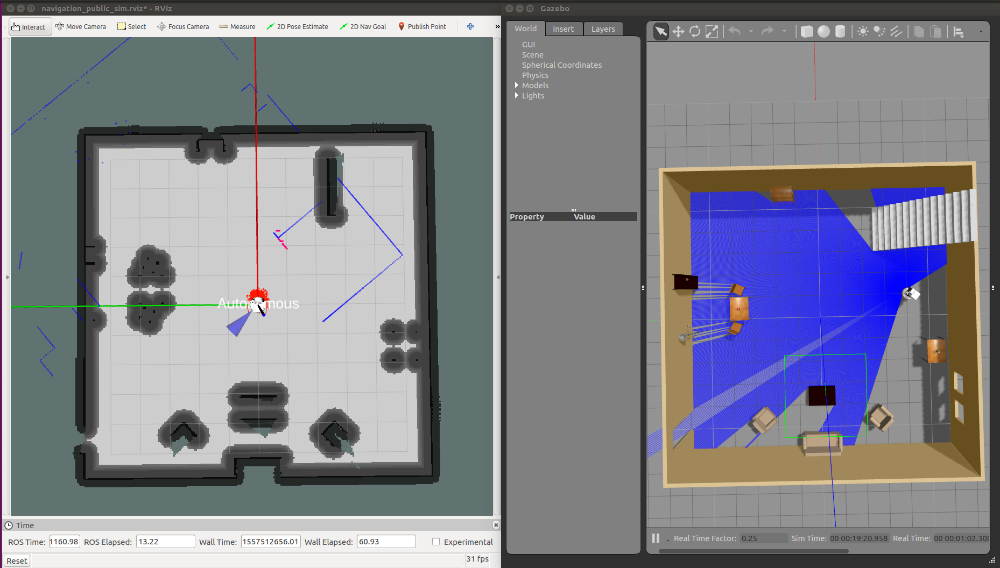

Como se puede observar en las imágenes, el robot aparece en una posición del mundo que no corresponde con el origen del mapa (_x: 0.0, y: 0.0_). El sistema de localización asume que el robot está en el conjunto de partículas (_Particle cloud_) que representan la
posible pose del robot.

Para poder localizar a **TIAGo**, llamamos al siguiente servicio en una nueva consola:

*Terminal 2*
```
$ source devel/setup.bash
$ rosservice call /global_localization "{}"
```

Esto provoca que el sistema probabilístico AMCL difunda partículas por todo el mapa como se puede apreciar en la siguiente foto:

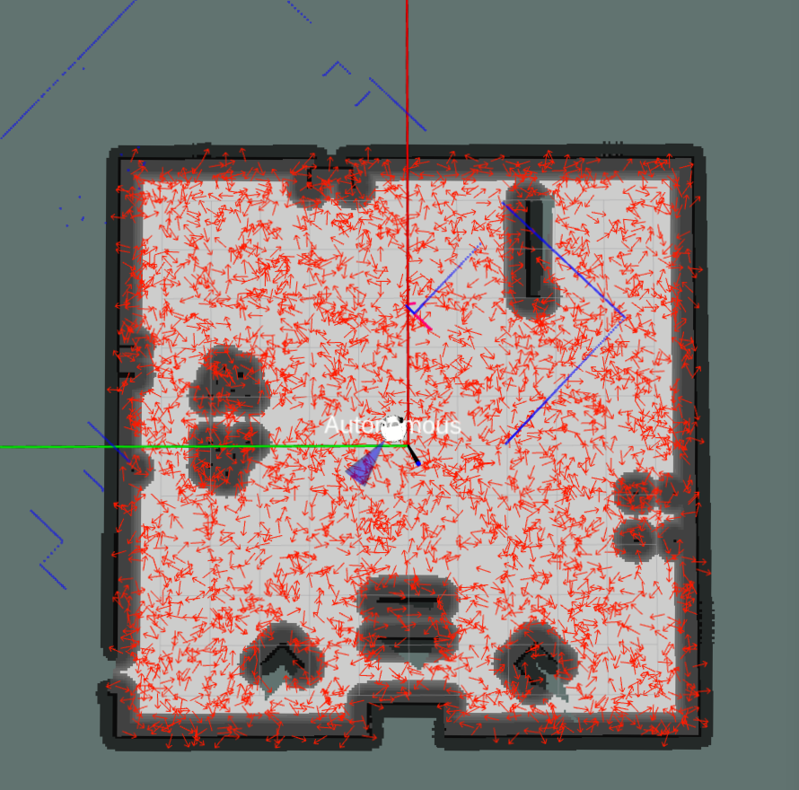

Una buena manera para ayudar al filtro de partículas a converger hacia la posición correcta es mover el robot. En la misma terminal que hemos usado para llamar al servicio anterior, tecleamos:

*Terminal 2*
```
$ source devel/setup.bash
$ rosrun key_teleop key_teleop.py
```

Ahora comenzamos a hacer que **TIAGo** rote sobre sí mismo, a moverlo con cuidado por el entorno, etc. y veremos que la nube de partículas empieza a juntarse en un determinado punto:

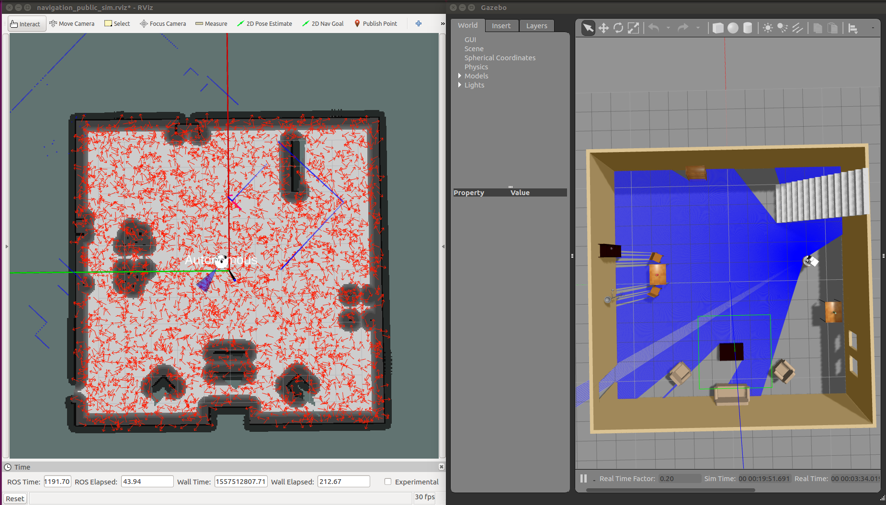
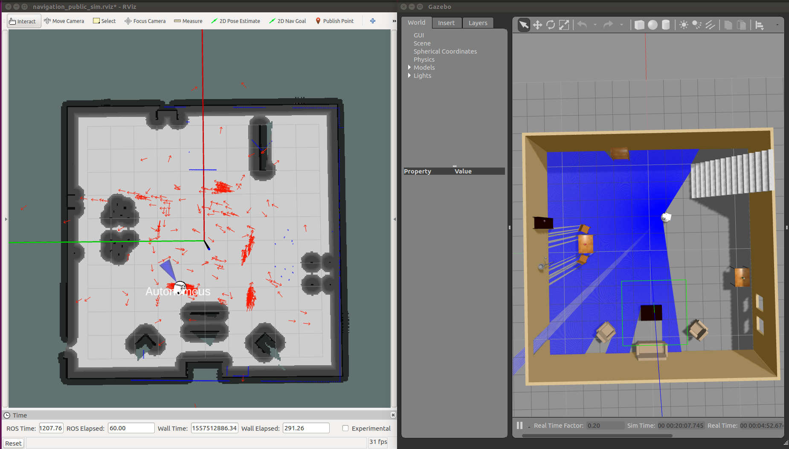
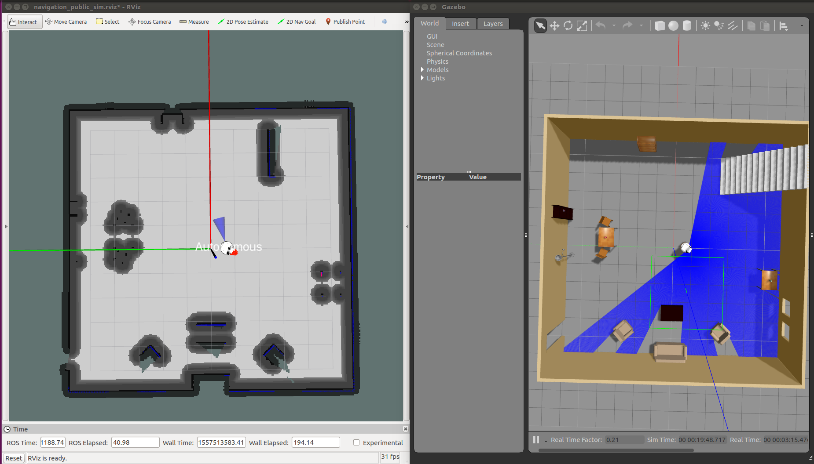

Es preferible limpiar los _mapas de costes_ ya que contienen datos erróneos debido a la mala localización del robot:

*Terminal 2*
```
$ source devel/setup.bash
$ rosservice call /move_base/clear_costmaps "{}"
```

Ahora el mapa de costes solo tiene en cuenta los obstáculos del mapa estático y el sistema está listo para realizar la navegación:

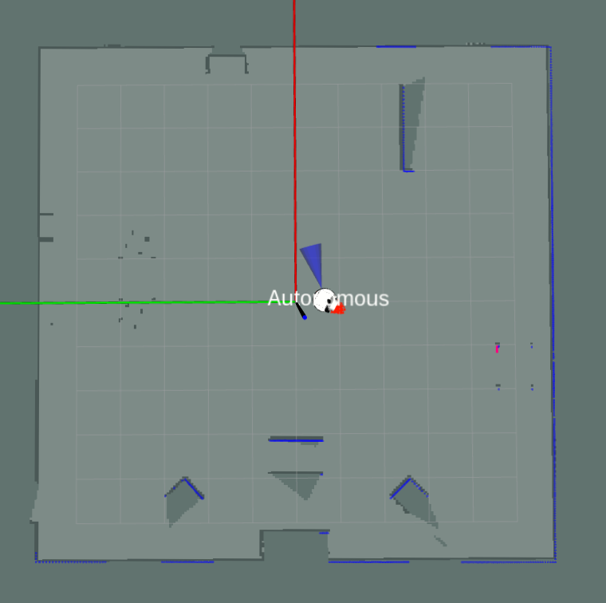


<br>

### Nodo ir a

Aunque la navegación ya está lista para ser usada, **TIAGo** necesita saber a qué posición debe ir tras haber localizado el objeto requerido. Para que el Nodo ir a sepa la pose destino se debe lanzar el Nodo detector de objetos y el Nodo auxiliar.

Ya se ha descrito cómo lanzar el Nodo detector de objetos, a continuación, explico cómo ejecutar el Nodo auxiliar.

<br>

--------

#### Nodo auxiliar

En una nueva terminal escribimos:

*Terminal 1*
```
$ source devel/setup.bash
$ roslaunch get_gazebo_obj get_gazebo_obj_launch.launch
target_object:=[coke_can|beer|pringles]
```

El nodo comenzará a analizar si en la visión de **TIAGo** se encuentra el objeto indicado.

--------

<br>

Una vez que el nodo de detección haya encontrado el objeto y el nodo auxiliar haya publicado la posición del objeto en el tópico _/gazebo_pose_obj_, pasamos a lanzar el _Nodo ir a_.

En una nueva terminal escribimos:

*Terminal 2*
```
$ source devel/setup.bash
$ roslaunch move_to_point move_to_point_launch.launch
```

A continuación, veremos que en **RVIZ** ha aparecido una flecha en el mapa. Esta flecha indica la posición y orientación que debe tomar **TIAGo**. Poco a poco irá haciendo el recorrido origen-destino:

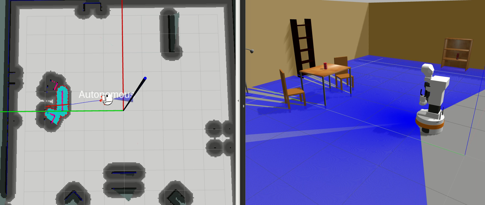
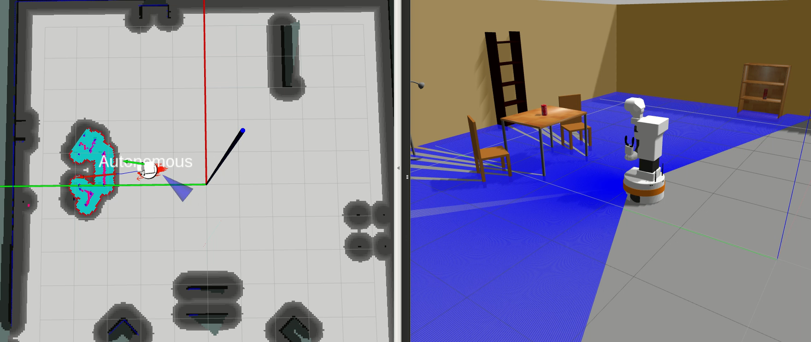
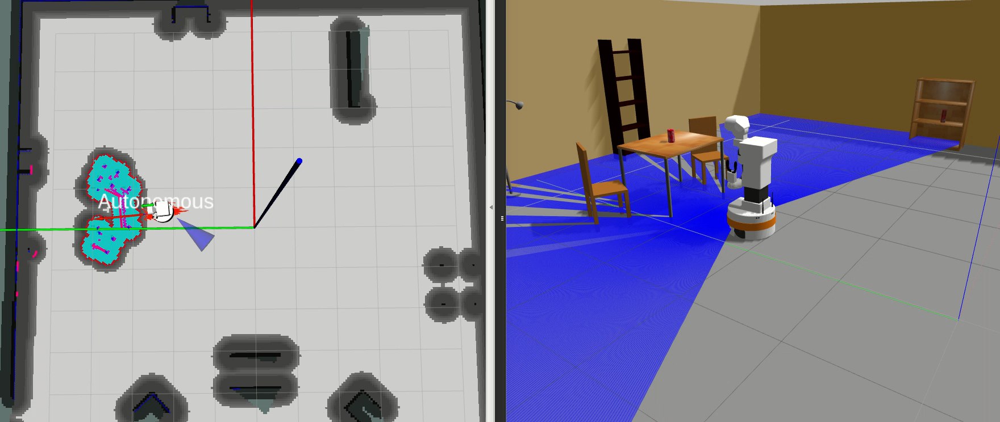
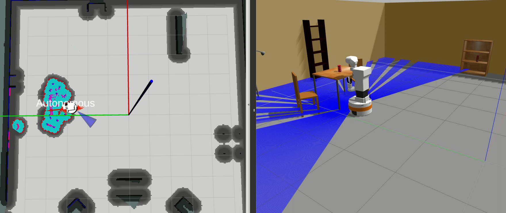
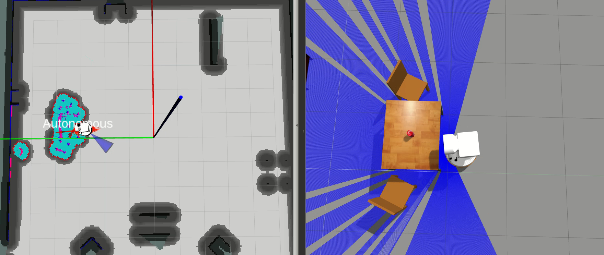


<br>

### Nodo de preparación

Para evitar que el brazo de **TIAGo** choque con el mobiliario a la hora de maniobrar para coger el objeto, cuando comience a ejecutarse el _Nodo ir a_, es conveniente lanzar el _Nodo
de preparación_.

En una terminal escribimos:

*Terminal 1*
```
$ source devel/setup.bash
$ roslaunch grasping_obj prepose_launch.launch
```

El robot tomará la siguiente posición:

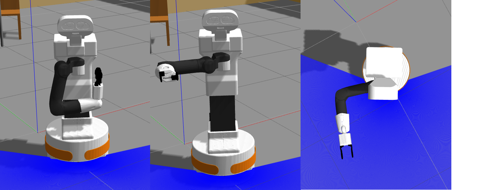


<br>

### Nodo recolector

Por último, queda obtener el ítem con la pinza del brazo robótico. Para ello también necesitaremos tener activo el _Nodo auxiliar_.

Una vez que tenemos a **TIAGo** listo en la pre-pose en el punto destino donde se encuentra el objeto, lanzamos el _Nodo recolector_:

*Terminal 1*
```
$ source devel/setup.bash
$ roslaunch grasping_obj picker_launch.launch
```

Tras esto, comenzará el proceso de obtención del objeto:

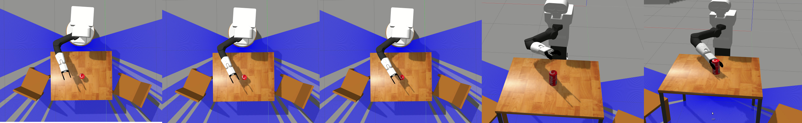

