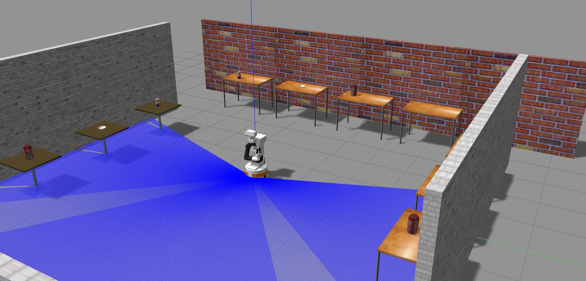

# B-BoT
### Simulación de reconocimiento de objetos cotidianos para asistentes robóticos especializados en demencia senil.

> Lanzar la simulación con Gazebo

```
$ catkin build
$ source devel/setup.bash
$ roslaunch tiago_gazebo tiago_gazebo.launch public_sim:=true robot:=[steel|titanium] world:=[_world]
```

*Ejemplo: TIAGo en el entorno 1 de obtención de imágenes para el dataset:*

```
$ roslaunch tiago_gazebo tiago_gazebo.launch public_sim:=true robot:=steel world:=get_dataset_objects01
```



> Lanzar el nodo **TakeImages**

```
$ catkin build take_images
$ source devel/setup.bash
$ roslaunch take_images take_images_launch_file.launch
```


